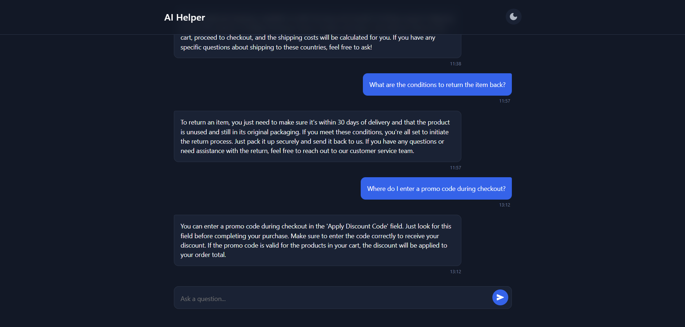
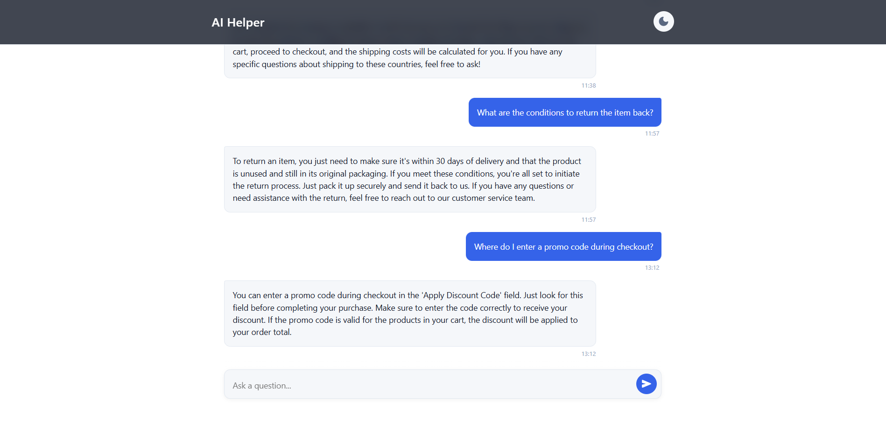

## Execution Instructions

1. **Clone the repository**
    
    `git clone https://github.com/DmitriyMushtruk/ITT.git`

2. **Create and configure .env file. Copy the example environment variables file and edit the values as needed**

    `cp .env.example .env`
    
This application is packaged as a single Docker service and can be started via Docker Compose or a Makefile.

### Using Docker Compose

1. **Build and run the container**
    
    `docker-compose up --build`
    
2. **Shutdown and clean up**
    
    `docker-compose down --rmi all --volumes --remove-orphans`
    

### Using Makefile

All commands below assume you have Docker and Docker Compose installed.

- **Build the image**
    
    `make build`
    
- **Start the service**
    
    `make up`
    
- **Stop and remove containers, images, volumes, and orphaned services**
    
    `make down`
    
- **Open a bash shell inside the running container**
    
    `make bash`

---

## Testing

There are two ways to run tests: via Docker Compose or via Makefile.

### Using Docker Compose

`docker-compose exec app pytest`

### Using Makefile

`make test`

---

## Endpoints

Interactive API documentation is available at [http://localhost:8000/api/docs](http://localhost:8000/api/docs).

- **GET /**  
    Serves the single‐page frontend (`static/index.html`).
    
- **POST /api/ask**  
    Request JSON: `{ "question": "<your question>" }`  
    Response JSON: `{ "answer": "<AI-generated answer>" }`  
    Embeds the question, finds the top FAQ context by cosine similarity, calls OpenAI ChatCompletion to generate an answer, and saves the Q&A pair.
    
- **GET /api/history**  
    Returns a JSON array of previously asked questions with their answers and timestamps.
    
- **GET /static/{path}**  
    Serves any file in the `static/` directory (e.g., CSS, JS).

---

## Approach Explanation

**Data Seeding**

- On startup, the application reads `seed.txt` to populate the `faq_entries` table in SQLite if it is empty.
    
- Each line in `seed.txt` represents a single FAQ context (e.g., shipping options, payment methods, return policy, etc.).
    

**Embedding Generation**

- After seeding, the `add_embedding()` routine scans the SQLite database for any FAQ entries with a `NULL` embedding.
    
- For each such entry, it calls the OpenAI Embedding API (e.g., `text-embedding-3-small`) to generate a vector representation.
    
- These embeddings are written back into the `faq_entries.embedding` column in SQLite.
    

**Retrieval Process**

1. When a user sends a question via `POST /api/ask`, the question text is embedded using the same OpenAI model.
    
2. All FAQ embeddings are loaded from the SQLite database in a single query (`SELECT * FROM faq_entries WHERE embedding IS NOT NULL`).
    
3. For each FAQ record, the code computes cosine similarity between the question’s embedding and the stored FAQ embedding.
    
4. The top-N (default 1) FAQ contexts whose similarity score is ≥ 0.4 are selected.
    
5. If no FAQ meets the threshold, the API replies with a polite “Sorry, I don’t have enough information to answer that question.”
    

**Answer Generation**

- The selected context(s) are concatenated into one prompt string. A “system” message directs the model to use only this context and answer in a friendly, conversational tone.
    
- OpenAI’s ChatCompletion endpoint (`gpt-3.5-turbo`) is called with a moderate temperature (0.8) so that responses remain engaging while still grounded in the provided context.
    

**Frontend**

- A single‐page HTML/JavaScript interface is served at `/`.
    
- It displays a textarea for the user’s question, an “Ask” button that triggers `POST /api/ask`, and a “Show History” button for `GET /api/history`.
    
- When a response arrives, the page dynamically shows the answer (or any error).
    

**Containerization**

- The entire application—FastAPI backend, static frontend, and SQLite database—runs inside one Docker container.
    
- Logs are written to `logger/app.log` inside the container, and that file is mounted to `./logger/app.log` on the host for real-time monitoring.
        

---

## Known Limitations / Trade-Offs

1. **Linear Scan over SQLite on Every Request**  
   - Currently, we load all FAQ embeddings from the SQLite database and compute cosine similarity for each FAQ on every `/api/ask` call. While the FAQ table is small (15–20 entries), this approach will slow down as the number of entries grows.  
   - Potential improvement: cache embeddings in memory or switch to a specialized vector index (e.g., FAISS, ElasticSearch with vector support, or SQLite FTS5).

2. **Fixed Similarity Threshold**  
   - The similarity threshold (0.4) and `top_n=1` are hardcoded. They may not be optimal for all question phrasings or context lengths. Tuning these values—or dynamically adjusting them—could yield better relevance.

3. **Single Data Source (`seed.txt`)**  
   - All FAQ data is loaded from a plaintext file (`seed.txt`) on startup. Making updates requires editing that file and restarting the container.  
   - Future improvement: add an admin API or simple UI to create/edit/delete FAQ entries at runtime without a restart.

4. **No Authentication or Rate Limiting**  
   - The API is currently open and has no authentication or throttling. In production, you would typically add API keys or JWT-based authentication and enforce rate limits to control usage (and OpenAI costs).

5. **No Retry Logic for OpenAI Calls**  
   - If an OpenAI embedding or chat-completion request fails (network error, rate limit, etc.), there is no automatic retry.  
   - Adding an exponential backoff + retry mechanism would make the system more robust under transient failures.

6. **Static Frontend Only**  
   - The frontend is a single static HTML page with vanilla JavaScript. For richer functionality (e.g., user authentication, theming, responsive design), consider introducing a frontend framework (React, Vue, etc.) and a build step.

## Examples

*Caption: The main interface (Dark theme) window showing the question input and answer display.*

---

*Caption: The main interface (White theme) window showing the question input and answer display.*

